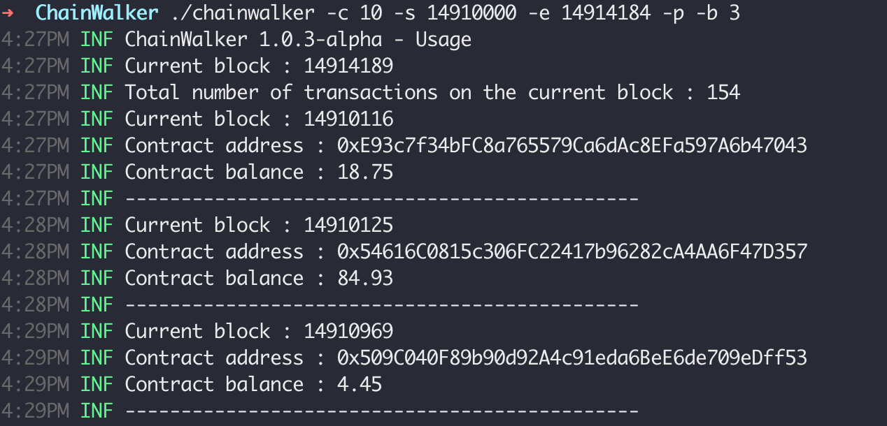
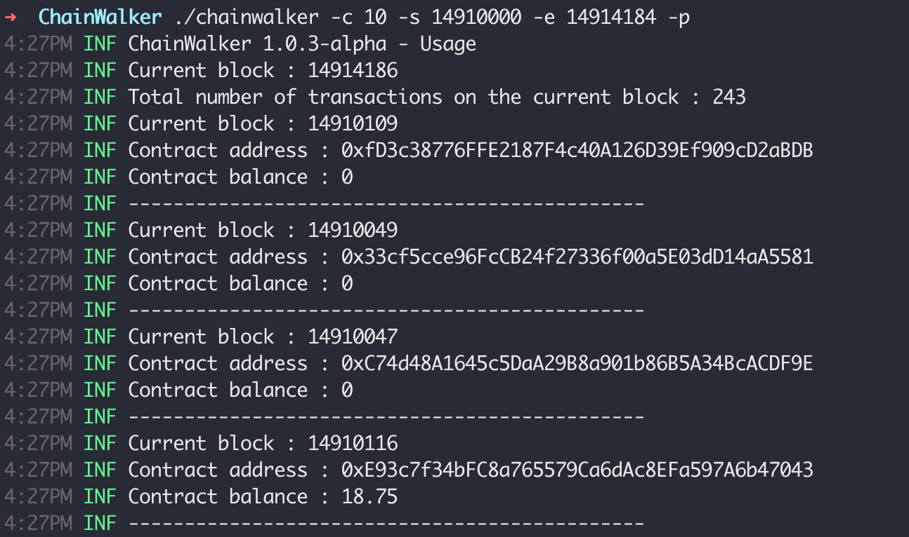
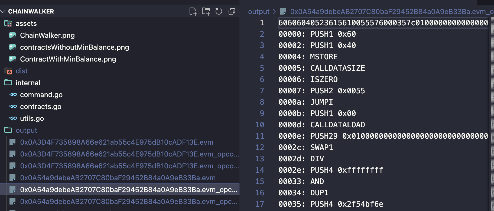

## What
[ChainWalker](https://0xsha.io/blog/lets-walk-on-the-chains-creating-a-smart-contract-crawler) is a smart scraper which uses RCP/IPC calls to extract the information. A small tool that can help us find contracts, extract the EVM code, and disassemble the opcodes. It allows us to select specific blocks or even specific contract balances. 


## Features 
- cross-platform 
- concurrent and fast 
- It doesn't require 3rd party API 
- downloads contract EVM
- disassemble EVM to opcode 


## Use cases
- academia: machine learning and data science, sampling contracts 
- cybersecurity: audit companies, threat intel, researchers 
- web3.0 startups: building next dApps, building web3.0 and blockchain specific APIs 
- marketing: unique insights (to make educated guesses)

## Usage 
[Download](https://github.com/0xsha/ChainWalker/releases/tag/v1.0.5) the artifact for your distro from the release section, execute it and follow the usage guide.

if you want to use EVM downloader (without ```-p```) option make sure you have EVM installed 

```

chainwalker -h
7:50PM INF ChainWalker 1.0.3-alpha - Usage
  -b float
    	minimum balance (default 0)
  -c int
    	concurrency (default 1)
  -d	sets log level to debug
  -e int
    	end block (int) (default 14010000)
  -ev string
    	EVM path (default "/usr/local/bin/evm")
  -h	shows usage
  -o string
    	output directory (default "output/")
  -p	print on console only and do not download or disassemble contracts
  -s int
    	start block (int) (default 14000000)
  -u string
    	RCP/IPC endpoint (default "https://cloudflare-eth.com")
```


## Demo


Extracts contracts with minumum balance of 3 eth 




Extracts contracts any balance on given block 




without ```-p``` option this is what created output will look like




## limitation 

- can not directly grab internal contract transactions 

## Dev 
- clone the repo
go build main.go 


## Troubleshooting 
If you are using a remote server and the program crashes or gives you an error, here are things you can try. 
- try to lower the concurrency number to as low as 1 
- make sure you didn't hit the API limits of your provider 
- change the node provider 
- change the block numbers 
- go with a smaller block distance (between start and end)
- make sure output directory exists in same directory as binary
- better solution : run you own node and connect to IPC using ``` /root/.ethereum/geth.ipc as -u  (url) ```


Credits :
- eth.wiki
- core-geth
- go-Ethereum
